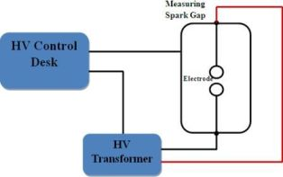

## Procedure

1. Place the High Voltage transformer unit about 7' away from the control unit.
2. The control unit is connected to supply voltage taking care that the earth connections are effective.
3. The multiple point control switch is set at its lowest tapping.
4. The push button on control unit is pressed firmly for at least 5 seconds. Note that no Breakdown to occurs, in which case button should be released at once without delay. Break down is indicated by a continuous discharge across the gap and meter indicating a sudden voltage drop.

## Observation Table

| S.No. | Distance (mm) | BDV for Sphere | BDV for Flat | BDV for Pointed |
|-------|---------------|----------------|--------------|-----------------|
| 1.    | .             | .              | .            | .               |
| 2.    | .             | .              | .            | .               |
| 3.    | .             | .              | .            | .               |
| n.    | .             | .              | .            | .               |

*BDV - Break down voltage in kV*

## Block Diagram

#### Fig.5.1: Block Diagram of HV Setup

  

