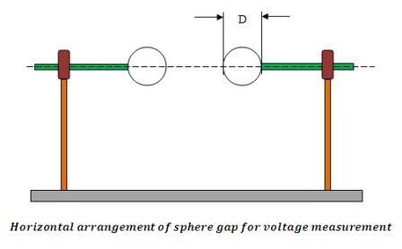
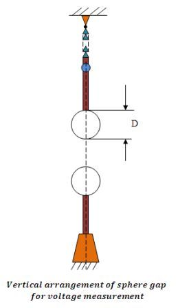
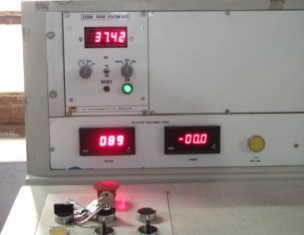
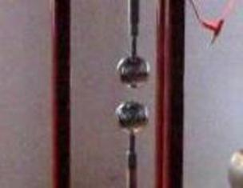
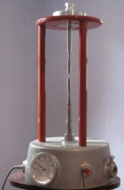
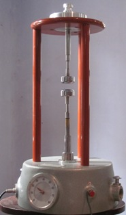
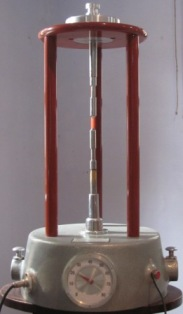

# Experiment 5 - Theory and Procedure

## Theory

High alternating voltages are required in laboratories for experiments and AC tests as well as for most of the circuits for the generation of high direct and impulse voltages. Test transformers generally used for this purpose have considerably lower power rating and frequently much larger transformation ratios than power transformers. The high voltage winding is so designed that it can withstand the routine breakdowns which generally occur on the specimen. The primary current is usually supplied by regulating transformers fed from main supply.

### Measurement of high alternating voltage

Measurement of high alternating voltage is performed with sphere gaps and it measures peak value of voltage. Breakdown of a spark gap occurs within a few microseconds once applied voltage exceeds the "static breakdown discharge voltage". Over such a short period the peak value of a power frequency voltage can be considered to be constant. Breakdown in gases will therefore always occur on the peak of low frequency AC voltages.

There are basically two basic arrangements of sphere gaps for measuring purposes i.e. first is horizontal arrangement and second is vertical arrangement. The horizontal arrangement is usually preferred for sphere diameters D < 50 cm used for lower voltage range; with the larger sphere the vertical arrangement is chosen; it is most suitable for measuring voltages with reference to earth potential only.

#### Horizontal Arrangement

#### Vertical Arrangement

## Procedure

1. Place the High Voltage transformer unit about 7' away from the control unit.
2. The control unit is connected to supply voltage taking care that the earth connections are effective.
3. The multiple point control switch is set at its lowest tapping.
4. The push button on control unit is pressed firmly for at least 5 seconds. Note that no Breakdown to occurs, in which case button should be released at once without delay. Break down is indicated by a continuous discharge across the gap and meter indicating a sudden voltage drop.

# Experiment 5 - Equipments Required

## Fig.1: High Voltage Transformer

## Fig.2: HV Control Desk

## Fig.3: Spherical Electrode

## Fig.4: Flat Electrode

## Fig.5: Disk Electrode

## Fig.6: Pointed Electrode

